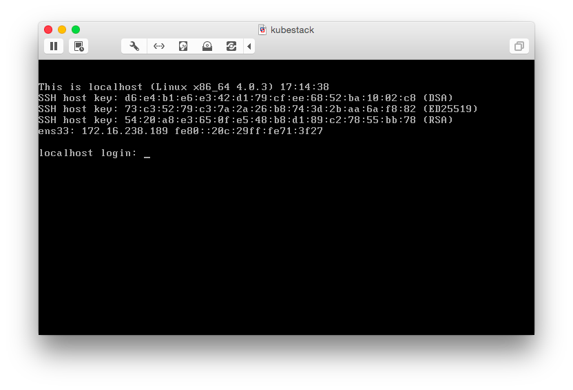

# kubestack-solo

This repo contains a Packer configuration template that can be used to create a Kubernetes VMware image for local testing.

## Build

```
packer build -var-file settings.json kubestack-solo.json
```

## Start Kubestack Solo VM

```
$ /Applications/VMware\ Fusion.app/Contents/Library/vmrun \
  start output-vmware-iso/kubestack-solo.vmx
```



## Configuring networking

By default the docker bridge IP is set to `10.200.10.1/24` and the Kubernetes service portal range is set to `10.200.20.1/24`. These ranges will only be assible inside the VM. In order to reach pods and services from your local Mac, run the following command to add static routes:

Replace `$vm-ip-address` with the IP address of the VM running Kubestack Solo:

```
sudo route add -net 10.200.10.0 -netmask 255.255.255.0 -host $vm-ip-address
sudo route add -net 10.200.20.0 -netmask 255.255.255.0 -host $vm-ip-address
```

## Configure kubectl

```
$ kubectl config set-cluster local --server=http://$vm-ip-address:8080
$ kubectl config set-context local --cluster=local
$ kubectl config use-context local
```

You now have a single node ready for use.

```
$ kubectl get nodes
```
```
NAME        LABELS    STATUS
127.0.0.1   <none>    Ready
```

## Logging In

```
$ chmod 600 files/kubestack_id_rsa
$ ssh -i files/kubestack_id_rsa core@$vm-ip-address
```
